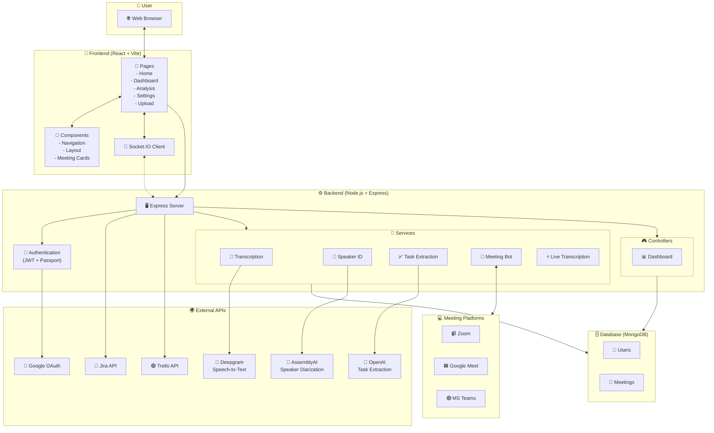

# 🏗️ ACTA-AI Architecture Guide

> A complete guide explaining how ACTA-AI works in simple language

---

## 📋 Table of Contents

1. [What is ACTA-AI?](#what-is-acta-ai)
2. [System Overview](#system-overview)
3. [Technology Stack](#technology-stack)
4. [Architecture Diagram](#architecture-diagram)
5. [How Each Part Works](#how-each-part-works)
6. [Data Flow](#data-flow)
7. [API Reference](#api-reference)
8. [Database Schema](#database-schema)

---

## 🎯 What is ACTA-AI?

**ACTA-AI** is an intelligent meeting assistant that:
- 🤖 **Joins your meetings** automatically (Zoom, Google Meet, MS Teams)
- 🎙️ **Records and transcribes** everything said
- 👤 **Identifies speakers** (who said what)
- 📝 **Extracts action items** and tasks
- 📊 **Provides analytics** and meeting insights
- 🔗 **Integrates with tools** like Jira and Trello

---

## 🗺️ System Overview

```
┌─────────────────────────────────────────────────────────────────────┐
│                         ACTA-AI Platform                            │
├─────────────────────────────────────────────────────────────────────┤
│                                                                     │
│   ┌─────────────┐    ┌─────────────┐    ┌─────────────────────┐    │
│   │   Browser   │───▶│   Frontend  │◀──▶│      Backend        │    │
│   │   (User)    │    │   (React)   │    │   (Node.js/Express) │    │
│   └─────────────┘    └─────────────┘    └──────────┬──────────┘    │
│                                                     │                │
│                          ┌──────────────────────────┼───────┐       │
│                          │                          │       │       │
│                    ┌─────▼─────┐  ┌────────────┐  ┌─▼─────┐ │       │
│                    │  MongoDB  │  │   Bot      │  │ APIs  │ │       │
│                    │ (Database)│  │ (Puppeteer)│  │       │ │       │
│                    └───────────┘  └────────────┘  └───────┘ │       │
│                                                     │       │       │
│                    ┌────────────────────────────────┼───────┤       │
│                    │       External Services        │       │       │
│                    ├─────────────┬─────────────────┬┘       │       │
│                    │  Deepgram   │  AssemblyAI    │ OpenAI │       │
│                    │ (Transcribe)│ (Speakers)     │ (Tasks)│       │
│                    └─────────────┴─────────────────┴────────┘       │
│                                                                     │
└─────────────────────────────────────────────────────────────────────┘
```

---

## 🛠️ Technology Stack

### Frontend (What Users See)

| Technology | What It Does | Why We Use It |
|------------|--------------|---------------|
| **React** | UI Framework | Build interactive web pages |
| **Vite** | Build Tool | Fast development & hot reload |
| **TailwindCSS** | Styling | Quick & beautiful design |
| **Framer Motion** | Animations | Smooth, professional animations |
| **Socket.IO Client** | Real-time | Live updates from server |
| **Axios** | HTTP Requests | Talk to backend APIs |
| **Recharts** | Charts | Display analytics & graphs |
| **Lucide React** | Icons | Beautiful & consistent icons |
| **React Router** | Navigation | Page routing & navigation |

### Backend (The Brain)

| Technology | What It Does | Why We Use It |
|------------|--------------|---------------|
| **Node.js** | Runtime | Run JavaScript on server |
| **Express** | Web Framework | Handle HTTP requests |
| **MongoDB** | Database | Store meetings, users, data |
| **Mongoose** | ODM | Easy database operations |
| **Socket.IO** | Real-time | Push live updates to frontend |
| **Puppeteer** | Browser Automation | Bot joins meetings in browser |
| **Multer** | File Upload | Handle audio file uploads |
| **JWT** | Authentication | Secure user sessions |
| **Passport** | OAuth | Google login integration |

### AI & External Services

| Service | What It Does | When It's Used |
|---------|--------------|----------------|
| **Deepgram** | Speech-to-Text | Transcribe audio to text (live & post-meeting) |
| **AssemblyAI** | Speaker Diarization | Identify WHO said WHAT |
| **OpenAI (GPT-4)** | Task Extraction | Find action items from transcripts |
| **Jira API** | Task Management | Create tasks from meetings |
| **Trello API** | Task Management | Create cards from meetings |

---

## 📊 Architecture Diagram



---

## 🔍 How Each Part Works

### 1. 🏠 Frontend Pages

| Page | File | Purpose |
|------|------|---------|
| **Home** | `Home.jsx` | Landing page + summon bot form |
| **Dashboard** | `Dashboard.jsx` | View all meetings & recordings |
| **Meeting Dashboard** | `MeetingDashboard.jsx` | Detailed view of single meeting |
| **Analysis** | `Analysis.jsx` | Analytics & insights |
| **Upload** | `Upload.jsx` | Upload audio files for analysis |
| **Settings** | `Settings.jsx` | Configure integrations (Jira/Trello) |
| **Profile** | `Profile.jsx` | User profile & account |

---

### 2. 🤖 The Meeting Bot

**Location:** `backend/src/bot/bot.js`

The bot is a browser automation system that:

```
1. 🔗 Receives meeting link (Zoom/Meet/Teams)
       ↓
2. 🚀 Launches headless browser (Puppeteer)
       ↓
3. 🔐 Navigates to meeting & joins
       ↓
4. 🎙️ Captures meeting audio in real-time
       ↓
5. 📤 Streams audio to Deepgram (live transcription)
       ↓
6. 💾 Saves full audio when meeting ends
       ↓
7. 🔄 Triggers post-meeting processing
```

**How Audio Capture Works:**
- Injects JavaScript into the meeting page
- Intercepts all audio elements
- Captures audio via MediaRecorder API
- Sends audio chunks to backend via Puppeteer's CDP

---

### 3. 📝 Transcription Service

**Location:** `backend/src/services/transcriptionService.js`

Two modes of operation:

#### Live Mode (During Meeting)
```javascript
// Uses Faster-Whisper (local) for speed
transcribeLive(audioPath, onProgress, enableSpeakerDiarization)
```
- 🏎️ Low latency
- 🖥️ Runs locally
- 📊 Real-time results

#### Post-Meeting Mode (After Meeting Ends)
```javascript
// Uses Deepgram + AssemblyAI for accuracy
transcribePostMeeting(audioPath, onProgress, enableSpeakerDiarization)
```
- 🎯 High accuracy
- ☁️ Cloud-based
- 👥 Full speaker identification

---

### 4. 👥 Speaker Identification

**Location:** `backend/src/services/speakerDiarizationService.js`

Uses AssemblyAI to identify speakers:

```
Audio File → AssemblyAI API → Speaker Segments
                                    │
                                    ▼
     ┌─────────────────────────────────────────────┐
     │  Segment 1: SPEAKER_A (0:00 - 0:15)        │
     │  "Hello everyone, let's start the meeting" │
     ├─────────────────────────────────────────────┤
     │  Segment 2: SPEAKER_B (0:15 - 0:30)        │
     │  "Thanks for joining, I have updates"      │
     └─────────────────────────────────────────────┘
```

**Returns:**
- Speaker segments with timestamps
- Speaker statistics (total speaking time)
- Confidence scores

---

### 5. ✅ Task Extraction

**Location:** `backend/src/services/taskExtractionService.js`

Uses OpenAI GPT-4 to find action items:

```
Meeting Transcript
       │
       ▼
┌──────────────────────────────────┐
│  OpenAI GPT-4o-mini              │
│  "Extract all actionable tasks"  │
└──────────────────────────────────┘
       │
       ▼
┌──────────────────────────────────────────────────┐
│ {                                                │
│   "task": "Update the design mockups",          │
│   "assignee": "John",                           │
│   "deadline": "Friday",                         │
│   "priority": "high",                           │
│   "category": "action-item"                     │
│ }                                               │
└──────────────────────────────────────────────────┘
```

**Task Categories:**
- 📋 Action items
- 🎯 Decisions
- 🔬 Research
- 📧 Communication
- 📅 Meetings
- 👀 Reviews
- 📄 Documentation
- ✅ Approvals

---

### 6. ⚡ Real-Time Communication

**Socket.IO Events:**

| Event | Direction | Purpose |
|-------|-----------|---------|
| `connection` | Client → Server | User connects |
| `meeting-status` | Server → Client | Bot status updates |
| `live-transcript` | Server → Client | Real-time text |
| `live-transcript-status` | Server → Client | Transcription state |
| `disconnect` | Either | User/bot disconnects |

---

## 🔄 Data Flow

### Flow 1: Joining a Meeting

```
┌──────────────────────────────────────────────────────────────────────┐
│                        User Flow: Join Meeting                        │
└──────────────────────────────────────────────────────────────────────┘

 👤 User                    🖥️ Frontend                 ⚙️ Backend
    │                           │                           │
    │  1. Enter meeting link    │                           │
    │──────────────────────────▶│                           │
    │                           │                           │
    │                           │  2. POST /api/bot/summon  │
    │                           │──────────────────────────▶│
    │                           │                           │
    │                           │    3. Create Meeting      │
    │                           │        in MongoDB         │
    │                           │                           │
    │                           │  4. {meetingId, status}   │
    │                           │◀──────────────────────────│
    │                           │                           │
    │  5. Navigate to Dashboard │                           │
    │◀──────────────────────────│                           │
    │                           │                           │
    │                           │  6. Launch Puppeteer Bot  │
    │                           │        (async)            │
    │                           │                           │
    │                           │  7. Socket: meeting-status│
    │                           │◀──────────────────────────│
    │  8. See status updates    │                           │
    │◀──────────────────────────│                           │
```

---

### Flow 2: Meeting Processing

```
┌──────────────────────────────────────────────────────────────────────┐
│                    Backend Flow: Process Meeting                      │
└──────────────────────────────────────────────────────────────────────┘

🤖 Bot              ⚙️ Backend              🌍 APIs              🗄️ DB
   │                    │                      │                    │
   │ 1. Meeting ends    │                      │                    │
   │───────────────────▶│                      │                    │
   │                    │                      │                    │
   │ 2. Save audio.webm │                      │                    │
   │───────────────────▶│                      │                    │
   │                    │                      │                    │
   │                    │ 3. Transcribe audio  │                    │
   │                    │─────────────────────▶│ Deepgram           │
   │                    │                      │                    │
   │                    │ 4. Identify speakers │                    │
   │                    │─────────────────────▶│ AssemblyAI         │
   │                    │                      │                    │
   │                    │ 5. Extract tasks     │                    │
   │                    │─────────────────────▶│ OpenAI             │
   │                    │                      │                    │
   │                    │ 6. Save all results  │                    │
   │                    │─────────────────────────────────────────▶│
   │                    │                      │                    │
   │                    │ 7. Emit: completed   │                    │
   │                    │─────────Socket.IO────────────────────────▶│
```

---

### Flow 3: Upload Audio File

```
┌──────────────────────────────────────────────────────────────────────┐
│                       User Flow: Upload Audio                         │
└──────────────────────────────────────────────────────────────────────┘

 👤 User                    🖥️ Frontend                 ⚙️ Backend
    │                           │                           │
    │  1. Select audio file     │                           │
    │──────────────────────────▶│                           │
    │                           │                           │
    │                           │  2. POST /api/upload      │
    │                           │     (multipart/form-data) │
    │                           │──────────────────────────▶│
    │                           │                           │
    │                           │    3. Multer saves file   │
    │                           │       to recordings/      │
    │                           │                           │
    │                           │    4. Create Meeting doc  │
    │                           │       status: "processing"│
    │                           │                           │
    │                           │  5. {meetingId}           │
    │                           │◀──────────────────────────│
    │                           │                           │
    │                           │  6. Start async processing│
    │                           │     - Transcription       │
    │                           │     - Speaker ID          │
    │                           │     - Task Extraction     │
    │                           │                           │
    │                           │  7. Socket: status updates│
    │                           │◀──────────────────────────│
    │  8. See processing status │                           │
    │◀──────────────────────────│                           │
```

---

## 🔌 API Reference

### Authentication APIs

| Endpoint | Method | Description |
|----------|--------|-------------|
| `/api/auth/google` | GET | Start Google OAuth |
| `/api/auth/google/callback` | GET | OAuth callback |
| `/api/auth/user` | GET | Get current user |
| `/api/auth/logout` | POST | Logout user |

### Meeting APIs

| Endpoint | Method | Description |
|----------|--------|-------------|
| `/api/bot/summon` | POST | Send bot to meeting |
| `/api/bot/stop/:meetingId` | POST | Stop bot |
| `/api/meetings` | GET | Get all meetings |
| `/api/meetings/:id` | GET | Get single meeting |
| `/api/meetings/:id` | DELETE | Delete meeting |
| `/api/upload` | POST | Upload audio file |

### Integration APIs

| Endpoint | Method | Description |
|----------|--------|-------------|
| `/api/integrations/save` | POST | Save Jira/Trello config |
| `/api/integrations` | GET | Get integrations |
| `/api/integrations/test/jira` | POST | Test Jira connection |
| `/api/integrations/test/trello` | POST | Test Trello connection |
| `/api/tasks/jira` | POST | Create Jira issue |
| `/api/tasks/trello` | POST | Create Trello card |

### Dashboard APIs

| Endpoint | Method | Description |
|----------|--------|-------------|
| `/api/dashboard/overview` | GET | Dashboard stats |
| `/api/dashboard/trends` | GET | Meeting trends |
| `/api/dashboard/speakers/:id` | GET | Speaker analysis |

---

## 🗄️ Database Schema

### User Model

```javascript
{
  googleId: String,      // Google OAuth ID
  email: String,         // User email (required, unique)
  name: String,          // Display name
  picture: String,       // Profile picture URL
  
  jiraConfig: {          // Jira integration settings
    domain: String,      // e.g., "yourcompany.atlassian.net"
    email: String,
    apiToken: String,
    projectKey: String   // e.g., "PROJ"
  },
  
  trelloConfig: {        // Trello integration settings
    apiKey: String,
    apiToken: String,
    listId: String       // Target list for cards
  },
  
  meetBotConfig: {       // Google Meet bot settings
    browserProfilePath: String,
    isConfigured: Boolean
  },
  
  createdAt: Date
}
```

### Meeting Model

```javascript
{
  meetingLink: String,       // Original meeting URL
  meetingId: String,         // Platform-specific ID
  zoomMeetingId: String,     // Zoom-specific ID
  topic: String,             // Meeting title
  meetingName: String,       // Display name
  botName: String,           // Bot display name
  
  status: String,            // Enum:
  // 'pending', 'starting', 'navigating', 'joining',
  // 'waiting', 'in-meeting', 'recording', 
  // 'processing', 'completed', 'failed'
  
  audioPath: String,         // Path to recorded audio
  transcription: String,     // Full transcript text
  
  speakerSegments: [{        // Who said what
    speaker: String,
    start: Number,
    end: Number,
    duration: Number,
    text: String,
    confidence: Number
  }],
  
  speakerStats: {            // Speaker statistics
    SPEAKER_A: {
      total_time: Number,
      segment_count: Number
    }
  },
  
  totalSpeakers: Number,     // Count of unique speakers
  
  analysis: Object,          // AI-generated insights
  
  extractedTasks: [{         // Action items
    task: String,
    assignee: String,
    deadline: String,
    priority: String,
    category: String,
    addedToJira: Boolean,
    addedToTrello: Boolean
  }],
  
  taskIntegrations: [{       // Integration tracking
    taskIndex: Number,
    jira: { added: Boolean, issueKey: String },
    trello: { added: Boolean, cardId: String }
  }],
  
  userId: ObjectId,          // Reference to User
  userEmail: String,
  createdAt: Date,
  completedAt: Date
}
```

---

## 📁 Project Structure

```
ACTA-AI/
├── 📂 backend/
│   ├── 📂 src/
│   │   ├── 📂 bot/
│   │   │   └── bot.js                 # Meeting bot (Puppeteer)
│   │   ├── 📂 config/
│   │   │   └── passport.js            # Google OAuth config
│   │   ├── 📂 controllers/
│   │   │   └── dashboardController.js # Dashboard logic
│   │   ├── 📂 middleware/
│   │   │   └── auth.js                # JWT verification
│   │   ├── 📂 models/
│   │   │   ├── Meeting.js             # Meeting schema
│   │   │   └── User.js                # User schema
│   │   ├── 📂 services/
│   │   │   ├── deepgramLiveService.js # Live transcription
│   │   │   ├── speakerDiarizationService.js
│   │   │   ├── taskExtractionService.js
│   │   │   ├── transcriptionService.js
│   │   │   └── ...
│   │   └── server.js                  # Main Express app
│   ├── 📂 recordings/                 # Saved audio files
│   ├── package.json
│   ├── requirements.txt               # Python dependencies
│   └── .env                           # Environment variables
│
├── 📂 frontend/
│   ├── 📂 src/
│   │   ├── 📂 components/
│   │   │   ├── Layout.jsx             # Page layout wrapper
│   │   │   └── Logos.jsx              # Platform logos
│   │   ├── 📂 pages/
│   │   │   ├── Home.jsx               # Landing page
│   │   │   ├── Dashboard.jsx          # All meetings
│   │   │   ├── MeetingDashboard.jsx   # Single meeting view
│   │   │   ├── Analysis.jsx           # Analytics
│   │   │   ├── Upload.jsx             # Upload audio
│   │   │   ├── Settings.jsx           # Integrations
│   │   │   ├── Profile.jsx            # User profile
│   │   │   └── ZoomRecordings.jsx     # Zoom recordings
│   │   ├── App.jsx                    # Main app + routing
│   │   ├── main.jsx                   # Entry point
│   │   └── index.css                  # Global styles
│   ├── index.html
│   ├── package.json
│   └── vite.config.js
│
├── 📄 README.md
├── 📄 ARCHITECTURE.md
└── 📄 .gitignore
```

---

## 🔑 Environment Variables

**Backend `.env` file:**

```env
# Server
PORT=3000
NODE_ENV=development

# Database
MONGODB_URI=mongodb://localhost:27017/acta-ai

# Authentication
JWT_SECRET=your-jwt-secret
SESSION_SECRET=your-session-secret
BOT_ENCRYPTION_KEY=32-character-encryption-key

# Google OAuth
GOOGLE_CLIENT_ID=your-google-client-id
GOOGLE_CLIENT_SECRET=your-google-client-secret

# AI Services
DEEPGRAM_API_KEY=your-deepgram-key
ASSEMBLYAI_API_KEY=your-assemblyai-key
OPENAI_API_KEY=your-openai-key
```

---

## 🚀 Quick Start

### 1. Start Backend
```bash
cd backend
npm install
npm start
# Server runs on http://localhost:3000
```

### 2. Start Frontend
```bash
cd frontend
npm install
npm run dev
# App runs on http://localhost:5173
```

### 3. Required Setup
- MongoDB running locally or cloud instance
- API keys configured in `.env`
- Google OAuth credentials (optional, for login)

---

## 📈 Summary

ACTA-AI is a **full-stack meeting intelligence platform** that combines:

| Layer | Technology | Purpose |
|-------|------------|---------|
| **Frontend** | React + Vite | Beautiful, fast UI |
| **Backend** | Node.js + Express | API & business logic |
| **Database** | MongoDB | Store all data |
| **Bot** | Puppeteer | Join meetings |
| **Transcription** | Deepgram | Convert speech to text |
| **Speaker ID** | AssemblyAI | Identify who spoke |
| **AI Tasks** | OpenAI GPT-4 | Extract action items |
| **Real-time** | Socket.IO | Live updates |
| **Integrations** | Jira/Trello APIs | Push tasks to tools |

---

*Made with ❤️ by the ACTA-AI Team*
